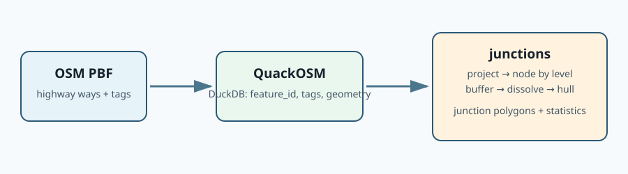
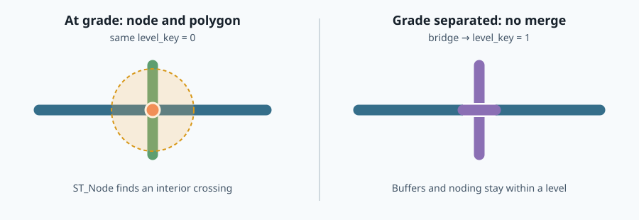
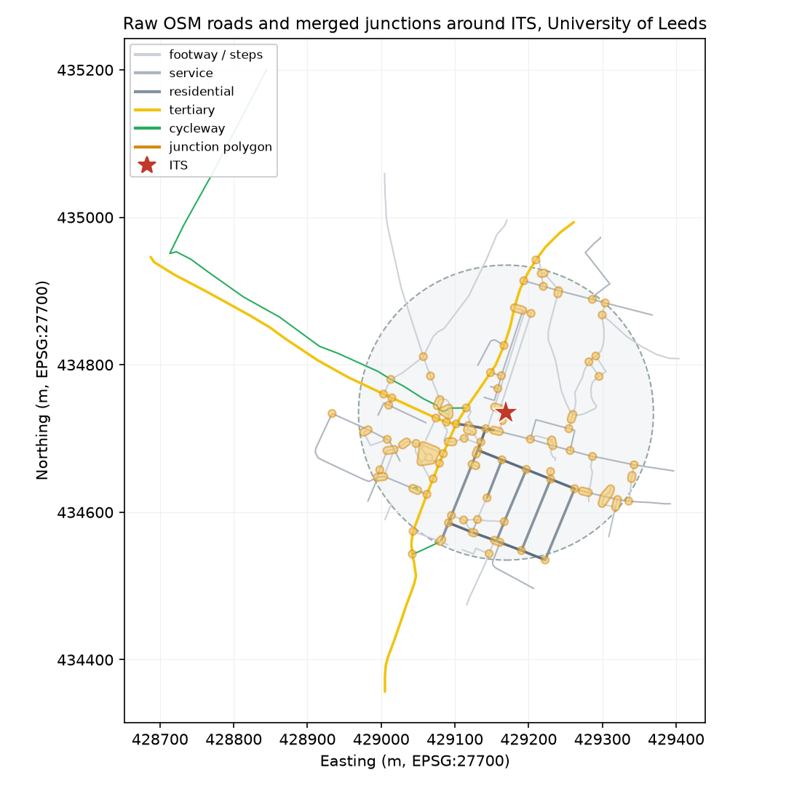

# junctions

A DuckDB extension for **configurable road-junction polygonisation and clustering**.

`junctions` turns road centrelines into polygons for whole junction systems. DuckDB Spatial performs geometry operations; this extension defines the reproducible road-junction policy: topology, buffering, clustering, grade separation, statistics, and deterministic IDs.



## Install

Until the extension is accepted into DuckDB Community Extensions, build and load it locally. The intended published interface is:

```sql
INSTALL spatial;
LOAD spatial;
INSTALL junctions FROM community;
LOAD junctions;
```

For local development:

```sh
make release
python test/test_integration.py
```

## Minimal OSM example with QuackOSM

[QuackOSM](https://github.com/kraina-ai/quackosm) reads an OSM PBF with DuckDB Spatial and writes a DuckDB table. Ask it for all `highway` features, retain compact tags, then pass its table to `junctions_from_osm`.

```python
from quackosm import convert_pbf_to_duckdb

convert_pbf_to_duckdb(
    "west-midlands-latest.osm.pbf",
    result_file_path="roads.duckdb",
    duckdb_table_name="quackosm",
    tags_filter={"highway": True},
    keep_all_tags=True,
    explode_tags=False,
)
```

For a locally built extension, the artifact is unsigned. Start the DuckDB CLI with `duckdb -unsigned`, or in Python create the connection with `duckdb.connect(config={'allow_unsigned_extensions': 'true'})` before running `LOAD` (as the integration test does).

```sql
INSTALL spatial;
LOAD spatial;
LOAD 'build/release/extension/junctions/junctions.duckdb_extension';

ATTACH 'roads.duckdb' AS osm (READ_ONLY);

COPY (
  SELECT *
  FROM junctions_from_osm(
    'osm.quackosm',
    output_crs := 'EPSG:4326'
  )
) TO 'junctions.parquet' (FORMAT PARQUET);
```

`junctions_from_osm` expects QuackOSM's compact table schema:

| Column | Type | Meaning |
|---|---|---|
| `feature_id` | `VARCHAR` | OSM identifier, for example `way/123` |
| `tags` | `MAP(VARCHAR, VARCHAR)` | Must include `highway`; `bridge`, `tunnel`, and `layer` are used when available |
| `geometry` | `GEOMETRY` | QuackOSM WGS84 road geometry |

### Automatic analysis CRS

`analysis_crs` defaults to `auto`, which selects a metre-based CRS from the centroid of the WGS84 bounding box of the case-study road data:

- centroid within the UK bounding box (`-8.75…1.96°`, `49.75…60.95°`) → **EPSG:27700** (British National Grid);
- otherwise → the centroid's UTM zone (`EPSG:326xx` north of the equator, `EPSG:327xx` south).

The selected value is returned in the `analysis_crs` output column. Override it for cross-zone, polar, or otherwise specialised studies:

```sql
FROM junctions_from_osm('osm.quackosm', analysis_crs := 'EPSG:3035');
```

Projection occurs before every distance and area operation.

### OSM topology and grade separation

OSM ways need not be split at every road junction. The adapter therefore nodes same-level linework with `ST_Node`, so an intersection that is an interior vertex is detected. It assigns a level from `layer=*`, otherwise inferring `+1` from `bridge=*`, `-1` from `tunnel=*`, and `0` for ground-level roads. Noding and buffer dissolution happen within a level only.



The default OSM buffer profile is deliberately small and inspectable:

| OSM highway class | Buffer |
|---|---:|
| `motorway`, `motorway_link` | 20 m |
| `trunk`, `primary` and links | 15 m |
| `secondary`, `tertiary` and links | 10 m |
| all other highway values | 5 m |

Override it when needed:

```sql
FROM junctions_from_osm(
  'osm.quackosm',
  analysis_crs := 'EPSG:27700',
  strategic_buffer := 18.0,
  local_road_buffer := 6.0,
  min_arms := 3
);
```

## Reproducible case study: ITS, Leeds

`examples/its_leeds.py` is a single, self-contained script that reproduces the figure below. It:

1. builds a 200 m circle around the Institute for Transport Studies (53.8081° N, 1.5585° W) with DuckDB Spatial;
2. downloads OpenStreetMap roads inside it from a Geofabrik West Yorkshire extract with QuackOSM;
3. merges them into junction polygons with `junctions_from_osm` (the centroid is in the UK, so `analysis_crs` resolves to EPSG:27700 automatically); and
4. renders raw roads and merged junctions to `docs/figures/its-leeds-junctions.png`.



```bash
make release
python examples/its_leeds.py
```

The script needs `duckdb`, `quackosm`, `shapely`, and `matplotlib`. The extension load is the only junctions-specific step; everything else is standard QuackOSM and DuckDB Spatial:

```python
import quackosm as qosm
import duckdb

# 200 m buffer around ITS, projected to WGS84 for QuackOSM
con = duckdb.connect(config={"allow_unsigned_extensions": "true"})
con.execute("INSTALL spatial; LOAD spatial")
con.execute("LOAD 'build/release/extension/junctions/junctions.duckdb_extension'")

qosm.convert_pbf_to_duckdb(
    "west-yorkshire-latest.osm.pbf",
    result_file_path="its_osm.duckdb",
    duckdb_table_name="quackosm",
    tags_filter={"highway": True},
    keep_all_tags=True,
    explode_tags=False,
    geometry_filter=buffer_wgs84,  # the 200 m circle
)

con.execute("ATTACH 'its_osm.duckdb' AS osm (READ_ONLY)")
junctions = con.execute(
    "SELECT * FROM junctions_from_osm('osm.quackosm')"
).fetchall()
```

## OpenRoads example

`junctions_cluster` preserves the existing OS OpenRoads contract: road links must already be split at their junction endpoints.

```sql
FROM junctions_cluster(
  'road_links',
  motorway_buffer := 20.0,
  a_road_buffer := 15.0,
  b_road_buffer := 10.0,
  minor_road_buffer := 10.0,
  default_buffer := 5.0,
  min_arms := 2,
  output_crs := 'EPSG:4326'
);
```

Required columns are `geom_bng GEOMETRY` (EPSG:27700) and `road_function VARCHAR`.

## Output

| Column | Meaning |
|---|---|
| `junction_id` | Deterministic ID for the current input/configuration; it intentionally does not preserve legacy GeoPandas IDs |
| `level_key` | OSM adapter only: vertical road level used for the cluster |
| `analysis_crs` | OSM adapter only: selected or user-supplied CRS used for topology, buffers, and area |
| `num_nodes` | Number of junction nodes in the system |
| `num_arms` | Sum of node degrees; see limitations |
| `area_sqm` | Convex-hull area in the analysis CRS |
| `centroid_x`, `centroid_y` | Centroid in the analysis CRS |
| `geom` | Junction polygon transformed to `output_crs` |

## Limits of the first OSM adapter

- It treats a same-level geometric crossing as connected. This follows normal OSM road topology, but cannot recover a missing shared node from QuackOSM's final geometry table.
- Grade separation is intentionally conservative: different levels never merge. Multi-level ramps and large interchanges need a future graph-aware aggregation policy.
- `num_arms` is a node-degree sum. It can over-count arms around traffic islands, dual carriageways, and slip roads; external-link counting is the next semantic upgrade.
- The adapter accepts QuackOSM's compact `feature_id`/`tags`/`geometry` schema. A generic normalised-road interface is a future extension.

## License

MIT. See [LICENSE](LICENSE).
